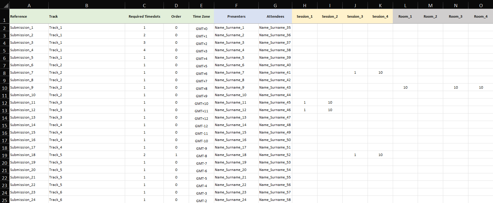
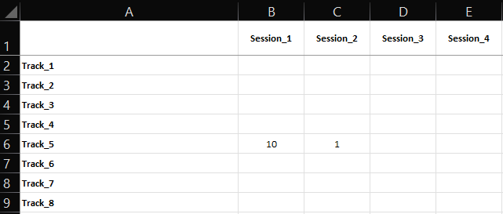
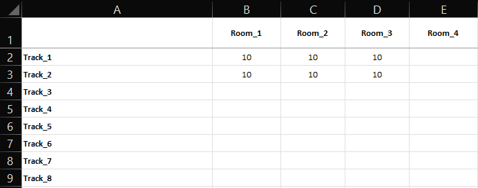
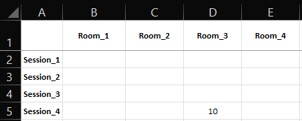
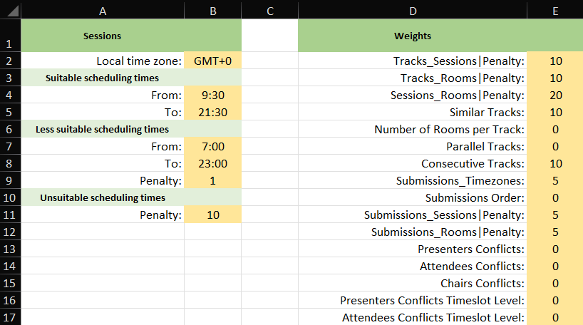

# CSPLib User Guides (Version 0.1)

## Citation

If you use any materials, data, or software from this repository in your research or conference planning, please cite the relevant publications:

- Ahmed Kheiri, Yaroslav Pylyavskyy, and Peter Jacko (2024) *CSPLib – A Benchmark Library for Conference Scheduling Problems.*

- Yaroslav Pylyavskyy, Ahmed Kheiri, and Peter Jacko (2024) *A Two-phase Matheuristic Approach to Conference Scheduling Problems.*

- Yaroslav Pylyavskyy, Peter Jacko, and Ahmed Kheiri. *A Generic Approach to Conference Scheduling with Integer Programming.* European Journal of Operational Research, 317(2):487-499, 2024. ISSN 0377-2217. doi: [10.1016/j.ejor.2024.04.001](https://doi.org/10.1016/j.ejor.2024.04.001).

## Overview

The Conference Scheduler is an advanced tool designed to optimise the process of scheduling conferences in an autonomous, effortless, and fully automated manner. This tool uses Excel, which follows a specific template, to store input data and Python for the implementation of optimisation algorithms, ensuring that conference schedules are created efficiently and effectively. The primary goal is to provide a complete solution for scheduling conferences with minimal manual intervention.

## Table of Contents

- [Installation](#installation)
- [Features](#features)
- [Benefits](#benefits)
- [Using the Conference Scheduler](#using-the-conference-scheduler)
- [Terminology](#terminology)
- [Constraints Available](#constraints-available)
- [Optimisation Methods Available](#optimisation-methods-available)
- [Data Format](#data-format)
- [Use Cases](#use-cases)
5. [Support](#support)
6. [Contributing](#contributing)
- [License](#license)

## Installation

To install CSPLib and its dependencies, follow these steps:

1. Clone the repository:
    ```sh
    git clone https://github.com/ahmedkheiri/CSPLib.git
    ```

2. Navigate to the project directory:
    ```sh
    cd CSPLib
    ```

3. Install the required dependencies:
    ```sh
    pip install -r requirements.txt
    ```

### Requirements

- NumPy >= 1.24.2
- pandas >= 2.2.2
- PuLP >= 2.8.0
- Python >= 3.8.16
- pytz >= 2022.2

## Features

1. **User-Friendly Data Input:**
   Users can easily input and manage their data using Excel. An Excel template along with data examples are provided to standardise the data entry process, minimise errors and offer flexibility.

2. **Automated Scheduling:**
   Automatically assigns tracks to sessions and rooms, and submissions to sessions, time slots and rooms based on the input data and optimisation criteria. It also detects and resolves potential conflicts, ensuring a smooth and conflict-free conference schedule.

3. **Constraints Management:**
   Contains a pool of constraints to select from and allows weight assignment for each constraint based on user's preferences.

4. **Advanced Optimisation Techniques:**
   Advanced optimisation algorithms are included in the scheduler to ensure quick schedule generation, even for large-scale conferences with thousands of submissions.

5. **Hybrid & Online Conferences:**
   Suitable for hybrid and online conferences where submissions need to be scheduled in appropriate sessions considering timezone information.

6. **Output and Reporting:**
   Generates comprehensive optimised schedules in Excel format that can be easily reviewed and shared with stakeholders. The user can view a detailed report of violations for each constraint and can manually edit the solution to observe the impact of changes on solution quality.

## Benefits

- **Time-Saving:**
  Automates the arduous and time-consuming manual process of conference scheduling, saving significant time and effort for conference organisers.

- **Optimisation:**
  Uses advanced optimisation techniques to deliver high-quality conference schedules considering numerous preferences and constraints.

- **Flexibility:**
  Adaptable to different types of conferences and can handle a wide range of scheduling requirements.

- **Accuracy:**
  Reduces the likelihood of human error through automated checks and optimisations.

- **Scalability:**
  Suitable for managing both small and large conferences.

## Using the Conference Scheduler

To effectively use the Conference Scheduler, follow these steps:

1. **Excel file configuration:**
   Users enter their data into the provided Excel template, set scheduling requirements, and specify preferences.

2. **Optimisation Process:**
   The Excel data is imported into the system, and users select their preferred algorithm for scheduling optimisation.

3. **Review and Adjustments:**
   The system generates the optimised schedule, which is then exported back into Excel. Users can easily review the generated schedule, make any necessary adjustments, observe the impact on the schedule quality, and finalise the conference plan.

## Terminology

- **Submission:** A formal event that requires scheduling at a conference (e.g., paper, presentation, tutorial, workshop, etc.).
- **Track:** A group of submissions with similar subject (e.g., stream, subject area, topic, etc.).
- **Time slot:** A fixed predefined amount of time available for presentation (e.g., 15 minutes, 20 minutes, etc.).
- **Session:** A certain time period of the conference that consists of a number of time slots (e.g., the duration of a session consisting of 4 time slots is 1 hour, assuming each time slot is 15 minutes).

## Constraints Available

Users are able to select the constraints to include during the schedule optimisation by assigning a weight value to each constraint. The following constraints are available to select from:

- **Presenters' conflicts:** In many conferences, authors are allowed to present more than one submission. This is resolved by either scheduling such submissions within the same room of a session or within different sessions (or time slots). Users can select between session or time slot level conflict resolution.

- **Presenters' preferences:** These are requests received from presenters in which they either express a preferred session to present their submission or declare their unavailability to present at specific sessions.

- **Presenters' time zones:** On the occasion of an online or hybrid conference, presenters may request the consideration of time zone differences upon scheduling.

- **Rooms preferences:** Sometimes presenters may request to present their submission at a specific room for various reasons. Some examples are that a room may provide specific facilities which others do not provide, and some rooms may be easier to access in comparison to others.

- **Attendees' conflicts:** Some conferences collect preferences from attendees regarding which submissions they would prefer to attend. In such cases, an attendee conflict occurs when two preferred submissions of an attendee are scheduled in parallel. This is resolved in the same way as presenters' conflicts, and users can select between session or time slot level conflict resolution.

- **Rooms capacities:** Users can express preferences regarding the scheduling of tracks into rooms by setting appropriate penalty values.

- **Similar tracks:** Sometimes, conferences have a number of tracks which are similar with the potential of attracting the interest of the same audience. Users can define which tracks are similar to avoid having them scheduled in parallel by setting appropriate penalty values.

- **Parallel tracks:** This constraint avoids scheduling the same track in parallel.

- **Session hopping:** Having a track scheduled in multiple rooms is inconvenient for the participants as they would have to switch rooms frequently. This constraint minimises the number of rooms that each track utilises.

- **Track chairs' conflicts:** Tracks are usually chaired by a person who might be also a presenter and/or an attendee at a conference. A track chair conflict occurs when either a track chair is responsible for two tracks which are scheduled in parallel or a track chair is also a presenter or an attendee of a submission belonging to another track which is scheduled in parallel.

- **Tracks' scheduling preferences:** Users can express preferences regarding the scheduling of tracks into sessions by setting appropriate penalty values.

- **Rooms unavailability:** Sometimes, certain rooms might be unavailable for utilisation during certain sessions. Users can define which rooms are unavailable during certain sessions by setting appropriate penalty values.

- **Consecutive tracks:** This constraint aims to schedule tracks in a consecutive manner.

- **Submission's Order:** Users can define the scheduling order of submissions within their tracks.

## Optimisation Methods Available

Users are able to select which optimisation method they prefer to optimise the conference schedule. Each optimisation method has its benefits and limitations which are summarised in [Benefits and Limitations Table](#benefits-and-limitations-table).

### Integer Programming

- **Description:** Two mathematical models are available, an exact model including basic constraints and an extended model including additional constraints.
- **More Information:** [Integer Programming Paper](https://doi.org/10.1016/j.ejor.2024.04.001)

### Matheuristic

- **Description:** A decomposed robust matheuristic solution approach that consists of two phases. In phase one, an integer programming model is used to build the high-level schedule by assigning tracks into sessions and rooms. Based on this solution, the low-level schedule is created where submissions are allocated into sessions, rooms, and time slots. In phase two, a selection perturbative hyper-heuristic is used to further optimise both levels of the schedule.

### Hyper-heuristic

- **Description:** A selection perturbative hyper-heuristic consisting of four low-level heuristics, specifically two swap heuristics, a reverse heuristic, and a ruin and recreate heuristic. Its framework involves a two-step iterative process during scheduling optimisation where, in the first step, a low-level heuristic is selected randomly and is applied to the schedule. Then, in the second step, if the modified schedule is not worse than the previous, it is accepted. Otherwise, it is rejected and the previous schedule is restored.

### Benefits and Limitations Table

| Method              | Benefits                                                                 | Drawbacks                                   |
|---------------------|--------------------------------------------------------------------------|---------------------------------------------|
| Integer Programming | Optimal solutions.                                                        | May fail to return solution.                |
|                     | Best for small to medium conferences with few constraints.                | Unsuitable for time slot level constraints. |
|                     | Best for instances where hard constraints can be satisfied.               | Unsuitable for large scale instances.       |
|                     |                                                                          | Commercial software license required.       |
| Matheuristic        | Fast and decent solutions.                                                | Sub-optimal solutions.                      |
|                     | Always finds solutions.                                                   | Commercial software license required.       |
|                     | Handles numerous constraints.                                             |                                             |
|                     | Suitable for both session and time slot level constraints.                |                                             |
|                     | Suitable for conferences of any size including large scale instances.     |                                             |
| Hyper-heuristic     | Decent solutions.                                                        | Optimality is not guaranteed.                      |
|                     | Always finds solutions.                                                   | Slower than Matheuristic.                   |
|                     | Handles numerous constraints.                                             |                                             |
|                     | Suitable for both session and time slot level constraints.                |                                             |
|                     | Suitable for conferences of any size including large scale instances.     |                                             |
|                     | No license is required.                                                   |                                             |

## Data Format

The Excel file containing the input data needs to follow the specific format as described in the following sections. Many examples are available in the [Dataset](https://github.com/ahmedkheiri/CSPLib/tree/main/Dataset) folder on GitHub. The Excel file contains the necessary inputs for the Conference Scheduler and allows the user to make configurations. It consists of the following sheets: submissions, tracks, sessions, rooms, tracks_sessions penalty, tracks_rooms penalty, similar tracks, and sessions_rooms penalty, and parameters.

Note that all string type inputs are **case sensitive** and **must exactly match each other across all sheets**, otherwise an error will occur. **Users are strongly suggested to avoid using special characters such as -, !, etc. as this may cause errors.**

### Submissions
The submissions sheet contains information and constraints for each submission. It consists of the following fields:
- **Reference:** Unique name or ID of submission. Each value is **case sensitive**, it must be **unique** and of **string** type. For example, NEW19A19, submission1, PaperOne, etc.
- **Track:** Name of the track to which the submission belongs. It refers to a group which contains similar submissions. Each value is **case sensitive** and must be a **string**. For instance, Analytics, Optimisation, Big Data and AI, etc.
- **Required Timeslots:** The number of time slots required for the submission. Each value must be an **integer**.
- **Order (optional):** The order in which the submission should be scheduled within its respective track. Each value must be an **integer**. If irrelevant, use 0.
- **Time Zone:** The time zone of the main presenter's location. The range of GMT is between -12 to +12 (inclusive) and is used to determine the time zone. Half-hour differences are not supported. For example, if a time zone is GMT+5:30, then a GMT+6 could be used instead. Each value is **case sensitive** and must be in the format: GMT+/-#. For example, GMT+0, GMT+2, GMT-4, etc. If irrelevant, fill in the time zone of the conference's location.
- **Presenters (optional):** The author or authors of the respective submission. Multiple authors can be used. Each value is **case sensitive** and must be a **string**. Note that if multiple authors are used, each author must be separated by a comma followed by a space. For example, Author1, Author2, Author3. If irrelevant, leave empty.
- **Attendees (optional):** The attendee or attendees of the respective submission. Multiple attendees can be used. Each value is **case sensitive** and must be a **string**. Note that if multiple attendees are used, each attendee must be separated by a comma followed by a space. For example, Attendee1, Attendee2, Attendee3. If irrelevant, leave empty.

In addition to these fields, separate columns must be used for each session followed by columns for each room as shown below. The next number of columns is determined by the total number of available sessions, where each column corresponds to a session (from column {H} to column {K} in this example). Under these columns, a penalty value may be set accordingly so as not to schedule the corresponding submission into the corresponding session. For instance, Submission_7 must be ideally scheduled in Session_1 or in Session_2 so we keep these values empty. Additionally, we do not want to schedule Submission_7 in Session_3 or Session_4, but if that cannot be fully satisfied then we prefer Session_3. To do so, we set a penalty value of 1 for Session_3 and a penalty value of 10 for Session_4.

Then, the number of the remaining columns is determined by the total number of available rooms, where each column corresponds to a room (from column {L} to column {O} in this example). Within these columns, a penalty value may be set accordingly so as not to schedule the corresponding submission into the corresponding room. For example, if we want Submission_9 scheduled in Room_2, we penalise all rooms except for Room_2.



### Tracks

The tracks sheet contains information for each track and consists of the following two fields:
- **Tracks:** Unique name or ID of track which contains submissions of similar subject. Each value is **case sensitive**, it must be **unique** and of **string** type. For instance, Analytics, Optimisation, Big Data and AI, etc.
- **Chairs (optional):** The chair or chairs of the respective track. Multiple chairs can be used. Each value is **case sensitive** and must be a **string**. Note that if multiple chairs are used, each chair must be separated by a comma followed by a space. For example, Chair1, Chair2, Chair3. If irrelevant, leave empty.

### Sessions

The Sessions sheet contains all the necessary information regarding sessions and consists of the following fields:
- **Sessions:** Unique name or ID of session. Each value is **case sensitive**, it must be **unique** and of **string** type. For example, Wed1, MonMorning, Thursday2, etc.
- **Max Number of Timeslots:** The maximum number of time slots in the respective session. Each value must be an **integer**.
- **Date:** The date that each session corresponds to. Each value must follow the format **MM/DD/YYYY**.
- **Start Time:** The time at which the session begins. Each value must be in the format **HH:MM**. For instance, 12:00, 16:30, etc.
- **End Time:** The time at which the session ends. Each value must be in the format **HH:MM**. For example, 12:00, 16:30, etc.

### Rooms

The Rooms sheet contains the names of the rooms and consists of the following field:
- **Rooms:** Unique name or ID of room. Each value is **case sensitive**, it must be **unique** and of **string** type. For example, Room 1, RoomA, etc.

### Tracks-Sessions Penalty

The Tracks-Sessions Penalty sheet is used to define penalty values to avoid scheduling a specified track into a specified session as presented in the figure below. Column A includes all tracks, and the number of next columns is given by the total number of sessions available, where each column corresponds to a session (from column B to column E in this example). Different penalty values can be used to express preferences. Note that penalty values must be **integers**. For instance, Track_5 must be ideally scheduled in Session_3 and/or in Session_4 so we keep these values empty. Additionally, we do not want to schedule Track_5 in Session_1 or Session_2, but if that cannot be fully satisfied then we prefer Session_2. To do so, we just set a small penalty value for Session_2 and a high penalty value for Session_1.



### Tracks-Rooms Penalty

The Tracks-Rooms Penalty sheet is used to control the scheduling process of tracks into rooms as displayed below. Column A contains all tracks, and the number of next columns is given by the total number of rooms available, where each column corresponds to a room (from column B to column E in this example). Different penalty values can be used to express preferences. Note that penalty values must be **integers**. For instance, if we want Track_1 and Track_2 scheduled in Room_4, then we set a penalty value for all rooms except for Room_4.



### Similar Tracks

The Similar Tracks sheet allows defining which pair of tracks should not be scheduled in parallel as shown below. Column A includes all tracks, and the number of next columns is given by the total number of tracks, where each column corresponds to a track (from column B to column I in this example). Different penalty values can be used to express preferences. Note that penalty values must be **integers**. Suppose Track_3 is similar to Track_6 and Track_8 and we do not want to schedule Track_3 and Track_6 or Track_3 and Track_8 in parallel. This can be defined by simply setting a penalty value for those pairs of tracks.


### Sessions-Rooms Penalty

The Sessions-Rooms Penalty sheet is used to define unavailability of rooms for certain sessions as presented below. Column A contains all sessions, and the number of next columns is given by the total number of available rooms, where each column corresponds to a room (from column B to column E in this example). Different penalty values can be used to express preferences. Note that penalty values must be **integers**. For instance, if Room_3 is unavailable during Session_4, then we add a penalty value for that session-room pair.



### Parameters

The Parameters sheet includes settings for hybrid or online conferences and allows setting weight values for penalties as shown below. Columns A and B are associated with settings regarding hybrid or online conferences. The "Local Timezone" field refers to the timezone that applies at the location of the conference. "Suitable Scheduling Times" fields indicate the ideal scheduling time window for which submissions are not penalised. "Less Suitable Scheduling Times" fields create a new time window for which submissions are slightly penalised, while "Unsuitable Scheduling Times" heavily penalise submissions. All times are converted into local times of online presenters. For instance, a submission would be penalised by 1 if the converted local time of the presenter is between 7:00 and 9:30 or between 21:30 and 23:00. If the converted local time is between 23:00 and 7:00 then a penalty of 10 will apply, otherwise if the converted local time is between 9:30 and 21:30 then no penalty applies. These settings along with defined session's start and end time are used to identify suitable sessions that are convenient for online presenters. Lastly, columns D and E are used to set weight values. Setting different weight values allows the prioritisation of the listed types of penalties. Note that the "Time Zone" field is **case sensitive** and must be in the following **string** format: GMT+/-\# (e.g., GMT+2, GMT-4, etc.). The "Time" field must be in the following time format **HH:MM** (e.g., 10:30, 19:15, etc.). Penalty and weight fields must be **integers**.



## Use Cases

The Conference Scheduler consists of the following modules: Main, Optimisation, Parameters, Problem, Room, Session, Solution, Solver_Checker_v1.1, Submission, and Track. To run the solver, the user should open and run the Main.py file. Some example use cases are presented in the sections below.

### Integer Programming

Two integer programming models are available: an exact model and an extended model. For best results, we recommend the GUROBI solver, which requires a license. Alternatively, the "GLPK_CMD" solver can be used, which is free. Note that both models only handle constraints on a session level, and if any model is infeasible, then either some constraints need to be relaxed, or another method should be selected to schedule the conference.

The exact model handles the following constraints: presenters' conflicts, presenters' preferences, presenters' time zones, room preferences, room capacities, parallel tracks, session hopping, track scheduling preferences, and room unavailability.

The extended model includes all the constraints of the exact model and the following additional constraints: attendees' conflicts, similar tracks, track chairs' conflicts, and consecutive tracks.

#### Schedule N2OR conference using the exact model and print solution's information

```python
from Optimisation import *
instance = "N2OR"
f_name = "..\\Dataset\\" + str(instance) + ".xlsx"
p = Problem(file_name = f_name)
parameters = p.ReadProblemInstance()
p.FindConflicts()
p.AssignTimezonesPenalties(parameters)
sol = Solution(p)
solver = ExactModel(p, sol)
solver.solve(timelimit = 3600)
print("Objective Value:", sol.EvaluateSolution())
print("All submissions scheduled?", sol.EvaluateAllSubmissionsScheduled())
sol.printViolations()
```


## Support

For support, please open an issue on the [GitHub repository](https://github.com/yourusername/conference-scheduler/issues).

## Contributing

We welcome contributions! Please read our [contributing guidelines](CONTRIBUTING.md) for more details.


## License

This software is licensed under the [MIT License](https://github.com/ahmedkheiri/CSPLib/blob/main/LICENSE.txt).

Note: If you intend to use the GUROBI solver for Integer Programming and Matheuristic algorithms, a separate license from GUROBI Optimisation is required. Please ensure GUROBI is installed and licensed according to their terms. The hyper-heuristic approach does not require GUROBI.
